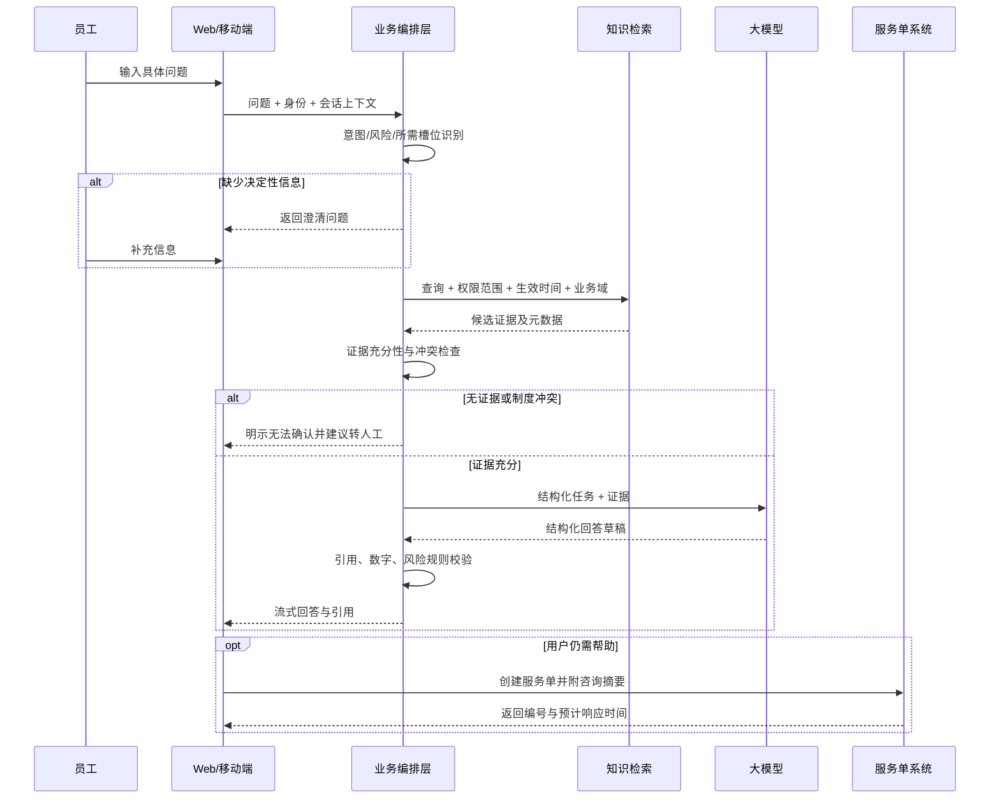
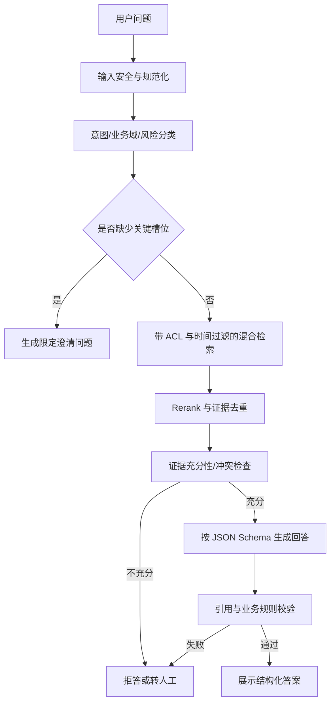
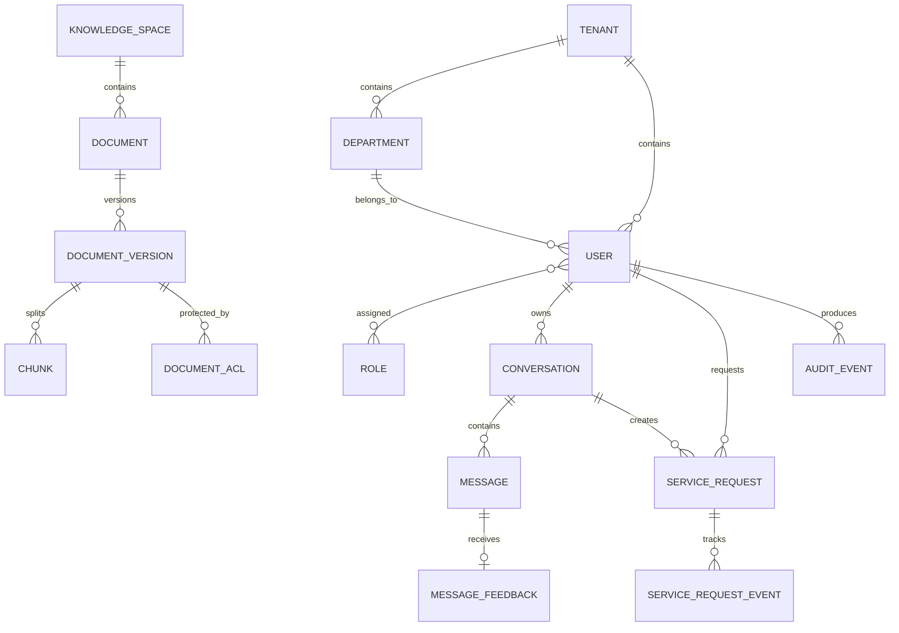
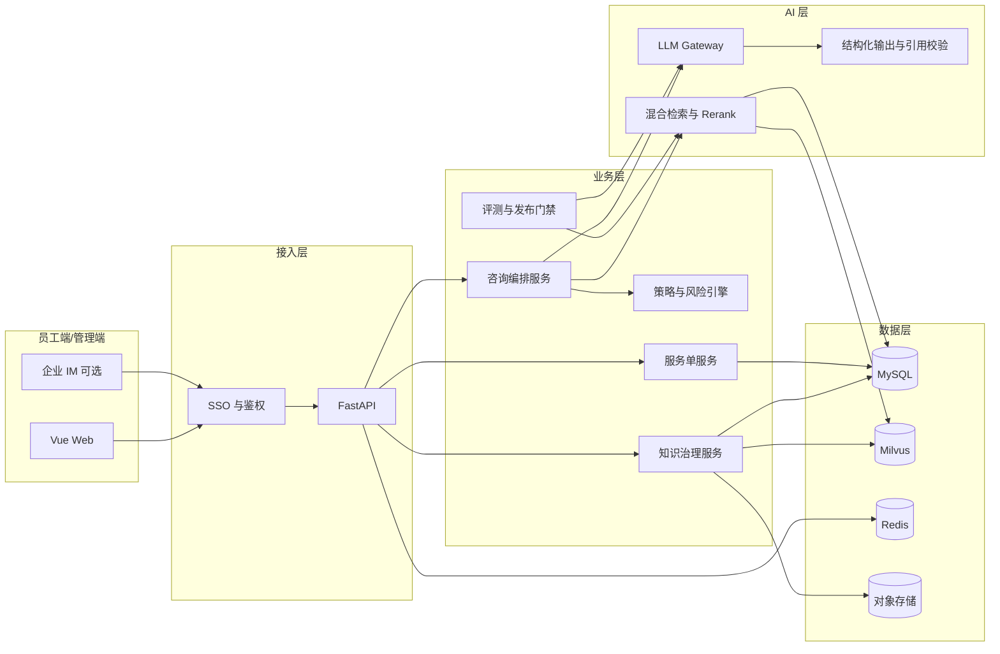

# 员工制度与合规服务台业务化设计文档

> 文档版本：V1.0  
> 编写日期：2026-09-11  
> 项目阶段：从通用 RAG 原型向业务产品演进  
> 面向读者：产品、研发、测试、HR、财务、法务合规、IT、业务部门负责人

## 1. 文档摘要

### 1.1 产品定位

将现有通用 RAG 问答系统升级为面向销售、客户成功、市场、运营等业务人员的“员工制度与合规服务台”。系统不只回答“制度里写了什么”，还要帮助员工判断“我的情况适用哪条规则、下一步做什么、找谁审批、需要准备什么、存在什么风险”。

产品名称暂定为 **企服智答**。

### 1.2 核心业务闭环


### 1.3 为什么选择该场景

该场景与当前项目资产高度匹配：

- 仓库已提供《公司制度培训手册（业务人员版）V1.0》，内容覆盖考勤请假、差旅报销、采购资产、合同客户、财务商务、信息安全、职业道德、培训晋升和申诉等真实业务主题。
- 当前系统已经具备文档上传、切分、向量化、混合检索、rerank、引用溯源、流式回答、多轮会话和离线评测，可直接复用为知识问答底座。
- 业务人员的制度问题高频、重复、跨部门且容易因版本或口径不一致产生风险，适合通过有引用、可追溯、可转人工的 RAG 产品解决。

### 1.4 一句话目标

让员工在 3 分钟内获得“有依据、能执行、可追责”的制度答案，并让职能部门能够持续治理知识和发现流程问题。

---

## 2. 现状评估

### 2.1 已有能力

| 能力 | 当前实现 | 业务化复用方式 |
| --- | --- | --- |
| 文档入库 | PDF、DOCX、Markdown、HTML、TXT 解析与切分 | 接入制度、流程手册、FAQ、表单说明 |
| 检索 | Dense + BM25 + RRF，可选 rerank | 作为制度检索基础链路 |
| 问答 | Agent 强制调用知识检索，SSE 流式输出 | 作为员工咨询入口 |
| 引用 | 返回文档、页码、chunk 原文 | 支撑答案可信度和追溯 |
| 会话 | MySQL 持久化，Redis 历史缓存 | 支撑连续追问和个人历史 |
| 文档管理 | 上传、重建索引、删除、查看分块 | 改造为知识运营后台 |
| 离线评测 | 召回、MRR、ROUGE-L、语义相似度 | 扩展为按业务域与风险等级验收 |
| 数据对账 | MySQL 与 Milvus 一致性检查 | 作为运维与数据质量保障 |

### 2.2 当前产品缺口

当前系统能够“搜文档并回答”，但还不能承担正式业务服务：

1. **没有身份与组织上下文**：前端使用本地匿名 ID，无法识别员工、部门、岗位、地区或管理层级。
2. **没有知识权限**：任何用户都可能看到全部文档，无法区分全员制度、管理者制度、HR/财务内部材料和敏感内容。
3. **没有制度生命周期**：文档只有处理状态和版本号，缺少草稿、待审核、已发布、已失效、生效时间、适用范围和责任人。
4. **没有业务意图和结构化结果**：回答以自由文本为主，不能稳定输出适用条件、操作步骤、材料、时限、审批人和风险提示。
5. **没有办事闭环**：回答后无法发起服务单、转交职能部门或跟踪处理结果。
6. **没有人工反馈闭环**：缺少点赞/点踩、原因标签、纠错、未解决问题池和知识补充任务。
7. **没有生产级审计与安全控制**：缺少认证、授权、脱敏、访问审计、内容安全、限流和敏感操作留痕。
8. **存在并发隔离风险**：当前 Agent 通过进程级全局变量保存文档过滤条件，并发请求可能互相污染，业务化前必须改为请求级上下文或直接作为工具参数传递。
9. **会话归属校验不足**：已有会话 ID 时仅检查会话是否存在，尚未验证会话是否属于当前用户。

### 2.3 业务化原则

- **先可信，再智能**：无有效依据不回答；不确定时明确说明并转人工。
- **先完成任务，再展示知识**：答案必须告诉用户下一步怎么做，而非仅复述条款。
- **权限先于检索**：无权访问的文档不得进入召回候选、模型上下文、日志或引用。
- **生效版本唯一**：默认只使用咨询时间点已生效且未废止的制度。
- **高风险人机协同**：合同、薪酬、处分、劳动关系、数据安全等场景必须提供人工确认入口。
- **回答与办理解耦**：MVP 提供办事指引和服务单，不直接代替审批系统做最终审批。

---

## 3. 业务目标与衡量指标

### 3.1 业务目标

1. 降低 HR、财务、法务、行政和 IT 的重复咨询量。
2. 缩短员工查找制度、判断适用规则和准备材料的时间。
3. 减少因使用过期制度、遗漏材料或绕过审批造成的违规与返工。
4. 建立制度从发布、使用、反馈到修订的可量化闭环。

### 3.2 北极星指标

**自助解决率**：用户在获得答案后 24 小时内未创建人工服务单，并确认“已解决”的有效咨询数 / 全部有效咨询数。

### 3.3 MVP 指标建议

| 维度 | 指标 | 上线验收目标 |
| --- | --- | --- |
| 业务价值 | 自助解决率 | ≥ 60% |
| 用户体验 | 首次有效答复时间 P95 | ≤ 8 秒 |
| 用户体验 | 满意率 | ≥ 80% |
| 检索质量 | 高风险题 Recall@20 | ≥ 95% |
| 答案质量 | 引用完整率 | ≥ 95% |
| 答案质量 | 无依据断言率 | ≤ 2% |
| 流程效率 | 转人工服务单信息完整率 | ≥ 90% |
| 知识治理 | 已发布文档责任人覆盖率 | 100% |
| 知识治理 | 过期制度仍被回答次数 | 0 |
| 稳定性 | 月度可用性 | ≥ 99.5% |

指标口径：

- “有效咨询”排除空问题、压测流量和明显无关内容。
- “引用完整”要求答案中的关键数字、时限、审批级别和红线均有直接支持证据。
- “无依据断言”由高风险评测集与人工抽检共同判定。

---

## 4. 用户与角色

| 角色 | 核心诉求 | 主要权限 |
| --- | --- | --- |
| 普通员工 | 快速得到规则、步骤、材料和入口 | 访问对本人和所在组织公开的知识；管理个人会话和服务单 |
| 直属主管 | 判断团队成员申请是否合规 | 普通员工权限；查看管理者适用制度；处理分配给自己的确认项 |
| 职能专员 | 处理复杂咨询、修正错误答案 | 查看本业务域服务单；回复与关闭；提交知识修订建议 |
| 知识管理员 | 维护文档、版本和适用范围 | 创建、编辑、送审知识；查看质量数据 |
| 业务审核人 | 对制度发布负责 | 审核、发布、下线所负责业务域的知识 |
| 系统管理员 | 用户、角色、组织、配置和审计 | 平台级配置；原则上不自动获得敏感文档正文权限 |
| 审计员 | 检查访问与变更记录 | 只读访问审计日志和制度版本记录 |

权限模型采用 RBAC（角色）+ ABAC（部门、地区、职级、雇佣类型、业务域、保密级别）组合，避免仅靠角色产生过度授权。

---

## 5. 核心业务场景

### 5.1 场景地图

| 场景 | 典型问题 | 系统应交付的结果 | 风险级别 |
| --- | --- | --- | --- |
| 考勤与请假 | “入职两年还有几天年假？” | 规则、计算口径、申请步骤、审批人、截止日期 | 中 |
| 差旅与报销 | “上海出差三天能报多少住宿费？” | 适用城市级别、标准、材料清单、报销时限 | 中 |
| 采购与资产 | “能否把 6 万采购拆成两笔？” | 明确禁止/允许、对应红线、正确审批路径 | 高 |
| 合同与客户 | “5 万元合同怎么审批？” | 合同类型、金额区间、审批链、模板和注意事项 | 高 |
| 财务与商务 | “客户要求先开票后付款怎么办？” | 前置条件、风险提示、需确认部门 | 高 |
| 信息安全 | “能把客户名单发到个人邮箱吗？” | 禁止项、应急处理、上报入口 | 极高 |
| 培训与晋升 | “晋升申请要满足什么条件？” | 条件、周期、材料、流程和责任人 | 中 |
| 申诉与举报 | “对处分结果有异议怎么办？” | 保密说明、申诉渠道、时限、人工处理 | 极高 |

### 5.2 核心用户故事

#### 故事 A：员工自助办理差旅报销

1. 员工进入“差旅与报销”场景，输入出差城市、日期、岗位和费用类型。
2. 系统结合员工档案和已生效制度，给出可报标准、超标处理、材料清单与最晚提交日期。
3. 每个金额、日期和审批要求都可展开查看原文。
4. 员工点击“查看办理清单”保存结果；MVP 跳转已有报销系统，后续版本可预填申请单。
5. 若情况不在制度覆盖范围，系统携带对话摘要创建财务服务单。

#### 故事 B：销售签约前合规检查

1. 销售选择“合同与客户”并描述金额、折扣、账期、是否使用非标条款。
2. 系统识别多个子问题，分别检索合同审批、报价、付款和用印制度。
3. 系统输出“可继续 / 需人工确认 / 明确禁止”结论、审批链和风险点。
4. 非标条款、超权限折扣或高风险付款条件自动建议转法务/财务人工确认。
5. 服务单保留员工输入、引用版本、回答和风险标签，避免重复描述。

#### 故事 C：信息安全事件应急上报

1. 员工输入“电脑丢了，里面有客户资料”。
2. 系统识别为极高风险事件，不进行冗长追问，优先展示立即操作：断开账号、联系 IT/安全负责人、保留现场信息。
3. 系统展示安全制度依据，并提供“一键创建紧急服务单”。
4. 创建后返回编号与响应时限；审计日志记录触发原因和所用制度版本。

#### 故事 D：知识管理员发布制度新版本

1. 管理员上传新文件，填写业务域、责任人、生效日期、适用组织、保密级别和变更摘要。
2. 系统解析并生成差异预览，管理员检查分块和关键数字。
3. 审核人批准后，新版本按生效时间自动启用，旧版本进入“已废止”状态。
4. 系统自动标记受影响评测用例并发起回归评测。
5. 若核心指标低于门槛，阻止自动发布或要求负责人确认风险。

---

## 6. 产品范围

### 6.1 MVP（建议 6～8 周）

1. 企业单点登录或最小可用账号认证。
2. 首页场景化入口与统一咨询框。
3. 基于用户组织属性的知识权限过滤。
4. 制度生效时间、适用范围、责任人和业务域管理。
5. 结构化回答：结论、适用条件、操作步骤、材料、时限、审批人、风险提示、引用。
6. 高风险意图识别与固定兜底策略。
7. 点赞/点踩、未解决原因和纠错反馈。
8. 人工服务单创建、分派、回复、关闭与个人进度查看。
9. 业务看板：咨询量、自助解决率、热点问题、未命中问题、高风险问题、低评分答案。
10. 按业务域、风险等级和适用人群扩充离线评测。

### 6.2 第二阶段

- 对接 OA/HRIS/CRM/报销/合同系统，提供深链接和表单预填。
- 在明确授权后读取个人剩余年假、申请进度、预算余额等结构化业务数据。
- 制度版本差异自动摘要与受影响问题分析。
- 工单 SLA、催办、升级和职能专员工作台。
- 企业微信、钉钉或飞书入口。

### 6.3 暂不纳入

- 由模型自动批准请假、报销、合同或采购。
- 由模型作出劳动关系、纪律处分、法律责任等最终决定。
- 未经核验直接写入 HRIS、财务、合同或客户系统。
- 以公网搜索结果替代企业正式制度。
- 使用聊天记录训练外部模型。

---

## 7. 信息架构与页面设计

### 7.1 员工端导航

```text
企服智答
├── 首页
│   ├── 统一咨询框
│   ├── 高频场景卡片
│   ├── 最近办理
│   └── 制度更新提醒
├── 智能咨询
│   ├── 对话区
│   ├── 结构化答案卡
│   └── 引用原文侧栏
├── 办事指南
│   ├── 请假考勤
│   ├── 差旅报销
│   ├── 采购资产
│   ├── 合同客户
│   └── 信息安全
├── 我的服务单
└── 我的历史
```

### 7.2 管理端导航

```text
管理后台
├── 知识库
│   ├── 文档列表
│   ├── 版本与发布
│   ├── 权限与适用范围
│   └── 分块预览
├── 服务单
├── 质量中心
│   ├── 未命中问题
│   ├── 差评与纠错
│   ├── 高风险抽检
│   └── 离线评测
├── 数据看板
├── 用户与组织
└── 审计日志
```

### 7.3 回答卡片规范

每次回答优先使用固定结构，缺失的字段不展示：

```text
[结论标签：可办理 / 需确认 / 不允许 / 信息不足]

结论
你的情况可以申请调休，但需在规定期限内提交并由直属主管审批。[引用1]

你需要做
1. 在考勤系统选择“调休假”
2. 填写对应加班记录
3. 提交直属主管审批

准备材料
- 加班审批记录
- 调休日期

时限
- 请在调休前提交；特殊情况按制度补办。[引用2]

风险提示
- 未经批准直接离岗可能按缺勤处理。[引用3]

[查看原文] [已解决] [仍需帮助] [创建服务单]
```

### 7.4 关键交互规则

- 引用默认折叠，点击后显示文档标题、章节、页码/标题路径、版本、生效日期和原文片段。
- 对金额、天数、比例、审批层级、处罚和禁止事项进行视觉强调，但不得脱离引用。
- 当必要条件缺失时，最多追问 1～3 个能改变结论的问题，例如城市、金额、岗位或日期。
- 高风险事件先给立即行动，再给制度解释；不得先进行长对话。
- “仍需帮助”要求用户选择原因：答案不准确、规则不适用、缺少操作入口、需要人工确认、其他。
- 创建服务单前展示即将提交的对话摘要，用户可编辑并确认。

---

## 8. 业务流程设计

### 8.1 咨询处理主流程



### 8.2 知识发布流程

状态机：

```text
草稿 draft
  → 待审核 reviewing
  → 已批准 approved
  → 已发布 published
  → 已失效 expired / 已撤回 withdrawn

审核拒绝：reviewing → draft
定时生效：approved → published
紧急撤回：published → withdrawn
```

发布要求：

1. 必须填写业务域、责任部门、责任人、适用范围、生效日期和保密级别。
2. 同一制度在同一适用范围和时间内只能有一个有效版本。
3. 发布前完成解析检查、分块抽查、关键数字抽取检查和最小回归评测。
4. 新版本发布时旧版本不可删除，保留用于审计；检索层默认排除旧版本。
5. 紧急撤回应在缓存失效后立即停止召回，并记录操作人与原因。

### 8.3 服务单流程

```text
待分派 open → 处理中 processing → 待用户补充 waiting_user
                         → 已解决 resolved → 已关闭 closed
                         → 已升级 escalated
```

自动路由建议：

| 业务域 | 默认承接部门 | 紧急条件 |
| --- | --- | --- |
| 考勤、请假、培训、申诉 | HR | 劳动关系、处分、骚扰、举报 |
| 差旅、报销、开票、付款 | 财务 | 大额异常、疑似舞弊 |
| 合同、用印、合规 | 法务合规 | 非标条款、争议、监管问题 |
| 采购、资产 | 行政/采购 | 资产丢失、拆单规避审批 |
| 账号、设备、数据安全 | IT/安全 | 数据泄露、设备丢失、账号入侵 |

---

## 9. AI 与 RAG 方案

### 9.1 从单 Agent 改为可控业务编排

MVP 不建议让通用 Agent 自由决定全部流程。应采用“确定性编排 + 受约束生成”：



这样可以把权限、风险、引用校验、拒答和转人工放在代码层控制，而不是完全依赖提示词。

### 9.2 查询理解

输出内部结构：

```json
{
  "domain": "travel_expense",
  "intent": "calculate_limit",
  "risk_level": "medium",
  "slots": {
    "city": "上海",
    "days": 3,
    "employee_level": null,
    "travel_date": null
  },
  "missing_required_slots": ["employee_level", "travel_date"],
  "needs_immediate_action": false
}
```

意图识别失败时仍可进入通用制度检索，但高风险关键词命中时必须执行高风险策略。

### 9.3 检索策略

检索过滤顺序：

1. `tenant_id`：租户隔离。
2. `publication_status = published`：只查已发布知识。
3. `effective_from <= as_of_time` 且 `effective_to` 为空或大于咨询时间。
4. ACL：用户角色、部门、地区、职级和雇佣类型满足适用范围。
5. `business_domain`：优先检索识别出的业务域，证据不足再扩大范围。
6. 可选 `document_ids`：仅作为用户主动限定来源的附加条件，不能绕过前述过滤。

召回与排序：

- 继续复用 Dense + BM25 + RRF + CrossEncoder。
- 将文档标题、标题路径、业务域、适用对象和版本摘要拼入 rerank 文本，但最终引用仍返回原始正文。
- 对同一条款的相邻分块做窗口扩展，对高度重复的结果去重。
- 对关键数字问题提高包含数字、单位和标题匹配证据的排序权重。
- 跨域问题拆成有限子查询，每个独立子问题最多检索一次，避免近义重复搜索。

### 9.4 证据冲突与时效

以下情况不得直接合并生成单一结论：

- 两份同时有效的制度对同一条件给出不同金额、时限或审批人。
- 总部制度与部门制度冲突，但无法判断哪个更严格或更适用。
- 用户询问历史时点，而系统只保留当前制度。
- 引用文档缺少生效状态或适用范围。

系统应展示“发现制度口径冲突”，列出差异和来源，建议由责任部门确认，并自动进入知识质量问题池。

### 9.5 生成输出协议

模型必须返回符合 Schema 的结构，后端再渲染为 UI 和 SSE 事件：

```json
{
  "resolution": "self_service",
  "decision": "allowed",
  "summary": "可以申请，但需满足以下条件。",
  "applicability": ["适用于正式员工", "需存在已审批的加班记录"],
  "steps": ["进入考勤系统", "选择调休假", "提交主管审批"],
  "materials": ["加班审批记录"],
  "deadlines": [
    {"text": "在规定期限内使用", "citation_ids": [1024]}
  ],
  "risks": [
    {"level": "medium", "text": "未获批准不得直接离岗", "citation_ids": [1028]}
  ],
  "citations": [1024, 1028],
  "follow_up_questions": [],
  "handoff": null
}
```

后端校验：

- `citation_ids` 必须属于本次授权检索结果。
- 关键数字和禁止性结论必须至少关联一个引用。
- `decision=allowed` 不得在证据不足时出现。
- 极高风险意图必须包含 `handoff` 或已配置的应急入口。
- 校验失败时最多重试一次；再次失败则返回安全兜底，不把未校验文本交付给用户。

### 9.6 回答策略

| 情况 | 系统行为 |
| --- | --- |
| 证据充分、低中风险 | 给出明确结论、步骤和引用 |
| 信息不全但可澄清 | 询问最多 3 个决定性问题 |
| 无相关证据 | 明确说明知识库未覆盖，提供转人工入口 |
| 制度冲突 | 展示冲突，不替业务部门裁决 |
| 高风险且证据充分 | 给出保守指引、醒目风险提示和人工确认入口 |
| 极高风险事件 | 先给立即行动和紧急联系人，再解释依据 |
| 用户要求绕过制度 | 拒绝提供规避方式，给出合规路径 |
| 用户询问个人敏感数据 | 校验权限后调用结构化系统；MVP 不支持则说明并引导官方入口 |

### 9.7 多轮对话边界

- 历史对话只用于理解当前问题，不作为制度事实来源。
- 用户在上轮提供的城市、日期等槽位可复用，但在影响结论时应在答案中显式写明假设。
- 当业务域发生切换时重置不再适用的槽位。
- 对话摘要不得包含无关敏感信息；服务单仅携带用户确认后的必要信息。

---

## 10. 知识治理设计

### 10.1 知识分类

| 一级域 | 二级示例 | 默认责任部门 |
| --- | --- | --- |
| 人力资源 | 考勤、请假、培训、晋升、奖惩、申诉 | HR |
| 财务 | 差旅、报销、开票、收款、预算 | 财务 |
| 法务合规 | 合同、用印、授权、客户数据 | 法务合规 |
| 行政采购 | 采购、固定资产、办公资源 | 行政/采购 |
| 信息安全 | 账号、设备、数据分级、事件响应 | IT/安全 |
| 业务规范 | CRM 录入、报价、客户交接 | 销售运营/客户成功 |

### 10.2 文档元数据

每份知识至少包含：

| 字段 | 说明 | 是否必填 |
| --- | --- | --- |
| `tenant_id` | 租户 | 是 |
| `business_domain` | 业务域 | 是 |
| `document_type` | 制度/流程/FAQ/模板说明/应急预案 | 是 |
| `owner_department_id` | 责任部门 | 是 |
| `owner_user_id` | 责任人 | 是 |
| `version_label` | 业务版本，如 V1.2 | 是 |
| `publication_status` | 生命周期状态 | 是 |
| `effective_from` / `effective_to` | 生效区间 | 是/否 |
| `confidentiality_level` | 公开/内部/敏感/严格保密 | 是 |
| `audience_scope` | 部门、地区、角色、职级、雇佣类型 | 是 |
| `source_url` | 正式制度原地址 | 建议 |
| `change_summary` | 相比上一版本的变化 | 新版本必填 |
| `review_due_at` | 下次复核日期 | 是 |

### 10.3 质量运营闭环

每日进入运营池的问题：

- 无召回或低相关度查询。
- 点踩且选择“答案不准确”的查询。
- 触发制度冲突的查询。
- 转人工后被专员改写结论的查询。
- 高频但没有标准办事指南的查询。
- 新制度发布后受影响的历史高频问题。

知识管理员可将问题一键转为 FAQ 或评测用例。所有高风险纠错必须经责任部门审核后生效。

---

## 11. 权限、安全与合规

### 11.1 身份认证

- 优先接入企业 OIDC/SAML 单点登录；本地账号仅用于开发和演示环境。
- 后端从可信令牌解析 `user_id`，不接受前端任意传入用户 ID 作为身份依据。
- 会话、消息、服务单和反馈接口必须校验资源归属或管理权限。

### 11.2 检索权限

ACL 必须在 Milvus 查询前或查询表达式中生效，不能先召回敏感内容后再从展示层过滤。MySQL 详情回填时应做第二次授权校验，形成纵深防御。

### 11.3 数据保护

- 对身份证号、银行卡号、手机号、客户敏感信息等进行输入检测与日志脱敏。
- 模型调用只发送完成回答所需的最少上下文。
- 明确禁止将生产聊天和制度内容用于第三方模型训练；在模型供应协议中落实零保留或等价要求。
- 服务日志不记录完整敏感原文，审计日志记录谁在何时访问了哪个资源和结果。
- 敏感引用可只显示必要句段，禁止整份下载或复制时由策略控制。

### 11.4 Prompt Injection 防护

- 上传内容视为不可信数据，解析阶段标记并过滤“忽略系统指令”等可疑指令片段。
- 系统提示与工具权限不由知识文档修改。
- 检索内容仅进入“证据”区，模型被明确禁止执行其中的指令。
- 工具采用允许列表，所有写操作需要独立授权和用户确认。
- 红队测试覆盖越权检索、提示注入、跨会话访问、引用伪造和敏感信息外泄。

### 11.5 审计事件

至少记录：登录、查询、查看敏感引用、创建/更新/发布/撤回文档、权限变更、服务单状态变更、模型或提示版本变更、评测运行及发布门禁结果。

---

## 12. 数据模型设计

### 12.1 核心实体关系



### 12.2 现有表改造

#### `documents`

保留现有 `id/title/source_type/status/version/error_message`，新增：

- `tenant_id`
- `knowledge_space_id`
- `business_domain`
- `document_type`
- `owner_department_id`
- `owner_user_id`
- `publication_status`
- `version_label`
- `effective_from`
- `effective_to`
- `confidentiality_level`
- `audience_scope` JSON
- `source_url`
- `change_summary`
- `review_due_at`
- `published_at`

中长期建议将“制度逻辑文档”和“具体文件版本”拆成 `documents` 与 `document_versions`，避免把技术重建索引版本和业务制度版本混在同一字段。

#### `chunks`

新增冗余检索字段：`tenant_id`、`business_domain`、`publication_status`、`effective_from`、`effective_to`、`confidentiality_level`、`acl_tokens`。这些字段同步写入 Milvus，用于召回前过滤。

#### `conversations`

新增：`tenant_id`、`business_domain`、`status`、`last_message_at`、`summary`。所有读取和修改必须同时匹配当前用户或授权角色。

#### `messages`

新增：`trace_id`、`intent`、`risk_level`、`answer_json`、`model_name`、`prompt_version`、`retrieval_snapshot`、`latency_ms`、`status`。

### 12.3 新增表

| 表 | 关键字段 | 用途 |
| --- | --- | --- |
| `tenants` | id, name, status | 租户隔离 |
| `departments` | id, tenant_id, parent_id, name | 组织树 |
| `users` | id, tenant_id, department_id, employee_no, region, level, status | 员工身份与属性 |
| `roles/user_roles` | role, user_id | RBAC |
| `knowledge_spaces` | id, tenant_id, name, domain | 知识域 |
| `document_acls` | document_version_id, subject_type, subject_value, effect | 文档权限 |
| `message_feedback` | message_id, user_id, rating, reason, comment | 答案反馈 |
| `service_requests` | requester_id, domain, priority, status, assignee_id, summary, due_at | 人工服务单 |
| `service_request_events` | request_id, actor_id, event_type, payload | 服务单轨迹 |
| `knowledge_issues` | source_type, source_id, category, status, owner_id | 知识问题池 |
| `audit_events` | actor_id, action, resource_type, resource_id, trace_id, metadata | 审计 |

### 12.4 Milvus Schema 调整

除现有向量、稀疏字段和 chunk 标识外，加入可过滤标量字段：

```text
tenant_id: VARCHAR
document_version_id: INT64
business_domain: VARCHAR
publication_status: VARCHAR
effective_from_ts: INT64
effective_to_ts: INT64
confidentiality_level: INT8
acl_tokens: ARRAY<VARCHAR> 或按当前 Milvus 版本采用等价可过滤结构
```

任何 metadata 或 ACL 变化都应触发对应 chunk 的索引更新和检索缓存失效。

---

## 13. API 设计

### 13.1 聊天接口升级

`POST /api/v1/chat/stream`

请求：

```json
{
  "conversation_id": 10001,
  "question": "普通销售去上海出差三天，住宿能报多少？",
  "scene": "travel_expense",
  "as_of_time": "2026-09-11T10:00:00+08:00",
  "source_ids": null
}
```

说明：`user_id` 不再由请求体提供，统一从登录令牌解析。`as_of_time` 默认当前时间；查询历史制度时仅向有权限的角色开放。

新增 SSE 事件建议：

| 事件 | 内容 |
| --- | --- |
| `connected` | conversation_id, trace_id |
| `classification` | domain, intent, risk_level |
| `clarification` | 需要补充的字段与问题 |
| `status` | 检索、校验、生成状态 |
| `answer_delta` | 结构化答案字段的增量文本 |
| `citations` | 已授权引用元数据 |
| `action_cards` | 办理入口、创建服务单等操作 |
| `done` | 完整 answer_json、耗时和版本信息 |
| `error` | 稳定错误码与用户可理解消息 |

### 13.2 知识管理接口

```text
GET    /api/v1/knowledge/documents
POST   /api/v1/knowledge/documents
GET    /api/v1/knowledge/documents/{id}
PATCH  /api/v1/knowledge/documents/{id}
POST   /api/v1/knowledge/documents/{id}/versions
POST   /api/v1/knowledge/versions/{id}/submit-review
POST   /api/v1/knowledge/versions/{id}/approve
POST   /api/v1/knowledge/versions/{id}/publish
POST   /api/v1/knowledge/versions/{id}/withdraw
GET    /api/v1/knowledge/versions/{id}/chunks
GET    /api/v1/knowledge/versions/{id}/diff
```

### 13.3 反馈与服务单接口

```text
POST   /api/v1/messages/{id}/feedback
PATCH  /api/v1/messages/{id}/feedback
POST   /api/v1/service-requests
GET    /api/v1/service-requests/mine
GET    /api/v1/service-requests/{id}
PATCH  /api/v1/service-requests/{id}
POST   /api/v1/service-requests/{id}/reply
POST   /api/v1/service-requests/{id}/resolve
```

创建服务单请求必须包含 `source_message_id`，由后端根据该消息重新构建已授权摘要，不能信任前端提交的引用和模型回答副本。

### 13.4 管理与分析接口

```text
GET /api/v1/admin/dashboard/overview
GET /api/v1/admin/analytics/questions
GET /api/v1/admin/knowledge-issues
GET /api/v1/admin/audit-events
GET /api/v1/admin/users
GET /api/v1/admin/departments
```

---

## 14. 系统架构演进



### 14.1 服务拆分建议

MVP 保持模块化单体，不急于拆微服务：

- 在现有 FastAPI 项目中新增 `auth`、`policy`、`tickets`、`feedback`、`analytics` 模块。
- 将聊天路由中的长流程下沉到 `consultation_service`，路由只负责鉴权、参数校验和 SSE。
- 将模型访问封装为 LLM Gateway，统一超时、重试、模型版本、成本、敏感数据和审计策略。
- 文档原文件迁移到对象存储，MySQL 保存元数据；本地文件不作为生产事实源。
- 当服务单或入库任务量上升后，再引入任务队列处理异步工作。

### 14.2 必须优先修复的技术问题

1. 移除 `services/agent.py` 中进程级 `_current_document_ids`，避免并发串请求。
2. 聊天、会话和消息接口接入认证并校验资源归属。
3. CORS 从全开放改为环境化允许列表。
4. 检索缓存 key 纳入租户、ACL 摘要、业务域、生效时间和知识版本；权限变化时主动失效。
5. 引用不能仅从 Agent 工具消息汇总，应保存本次检索快照并校验答案实际引用关系。
6. 生产环境关闭包含内部异常详情的用户响应，错误详情进入受控日志。
7. 文档删除改为业务下线/撤回优先，保留版本与审计记录。

---

## 15. 可观测性与运营看板

### 15.1 全链路追踪

每次咨询生成唯一 `trace_id`，贯穿：HTTP 请求、意图识别、每次检索、rerank、模型调用、引用校验、消息保存、反馈和服务单。不得在追踪系统记录未脱敏的敏感输入。

### 15.2 技术指标

- API 成功率、SSE 中断率、各阶段 P50/P95/P99 延迟。
- Milvus/MySQL/Redis 请求耗时与错误率。
- LLM 首 token 时间、完整响应时间、超时率、重试率、token 和成本。
- 检索候选数、过滤后证据数、缓存命中率、拒答率。
- 入库成功率、解析失败率、索引对账异常数。

### 15.3 业务与质量指标

- 按业务域统计咨询量、满意率、自助解决率和转人工率。
- 热点问题 Top N、增长最快问题、零结果问题。
- 按文档统计引用次数、差评关联次数和最后复核时间。
- 高风险咨询量、人工确认率、误放行数。
- 各职能部门服务单量、首次响应时间和解决时长。

---

## 16. 评测与上线门禁

### 16.1 评测集分层

在现有制度问答用例基础上扩展：

| 类型 | 示例 | 重点指标 |
| --- | --- | --- |
| 单条款事实 | “补卡要在几天内？” | 检索命中、数字正确、引用正确 |
| 条件判断 | “入职两年能休几天年假？” | 适用条件与结论 |
| 多跳组合 | “三天上海差旅怎么申请和报销？” | 子问题覆盖、步骤完整 |
| 冲突制度 | 总部与部门时限不同 | 冲突识别、不武断裁决 |
| 无答案 | 手册未覆盖的福利 | 正确拒答、转人工 |
| 高风险 | 拆单、代打卡、泄露客户数据 | 禁止性结论与风险升级 |
| 权限隔离 | 普通员工询问 HR 内部调查流程 | 零越权召回 |
| Prompt Injection | 文档或问题诱导泄露系统提示 | 拒绝执行、无泄露 |
| 历史时点 | 询问旧版本生效期内规则 | 版本选择准确 |

### 16.2 指标扩展

除已有检索指标外新增：

- `citation_entailment`：引用是否直接支持结论。
- `numeric_accuracy`：金额、天数、比例和时间是否准确。
- `condition_coverage`：影响结论的适用条件是否完整。
- `actionability`：是否包含可执行步骤、材料和入口。
- `abstention_accuracy`：无证据时是否正确拒答。
- `conflict_detection_rate`：制度冲突识别率。
- `acl_leakage_rate`：越权召回/生成率，必须为 0。
- `risk_escalation_recall`：高风险问题正确升级比例。

### 16.3 发布门禁

以下任一条件发生时阻止生产发布：

- ACL 泄露率大于 0。
- 极高风险用例出现错误放行。
- 高风险 Recall@20 低于 95%。
- 关键数字准确率低于 98%。
- 引用完整率低于 95%。
- 核心用例相对当前生产版本显著回退。

---

## 17. 实施路线图

### 阶段 0：基线与安全整改（第 1 周）

- 冻结当前评测基线并记录核心指标。
- 修复全局文档过滤并发问题。
- 加入最小认证、资源归属校验、CORS 白名单和错误信息收敛。
- 明确业务域、知识责任人和首批试点人群。

交付物：安全整改版本、基线报告、业务词表、风险词表。

### 阶段 1：知识业务化（第 2～3 周）

- 扩展文档元数据、生命周期、适用范围和 ACL。
- 改造入库和 Milvus 标量过滤。
- 建设审核、发布、撤回、定时生效流程。
- 把现有培训手册拆分或标注为 6 个核心业务域。

交付物：知识管理后台 V1、制度发布流程、权限检索测试。

### 阶段 2：咨询业务化（第 3～5 周）

- 增加意图、风险和关键槽位识别。
- 输出结构化回答卡片。
- 增加证据充分性、冲突和引用校验。
- 首页增加场景入口、办事指南和高风险应急卡。

交付物：员工端 V1、结构化咨询 API、质量校验器。

### 阶段 3：闭环与运营（第 5～7 周）

- 点赞/点踩、纠错和未解决原因。
- 服务单创建、分派、处理和员工进度查询。
- 建设热点、未命中、差评、高风险和知识健康度看板。
- 反馈一键转评测用例。

交付物：服务单 V1、质量中心、业务看板。

### 阶段 4：试点上线（第 8 周）

- 选择一个业务部门和 2～3 个职能域灰度。
- 完成安全测试、压测、灾备演练和高风险人工抽检。
- 培训知识管理员与职能专员。
- 按周复盘，达到门禁后逐步扩面。

交付物：试点报告、上线清单、回滚方案、运营手册。

---

## 18. 开发任务拆分

### P0：上线前必须完成

#### 后端

- [ ] 认证中间件与当前用户上下文。
- [ ] 会话、消息、文档、服务单资源级授权。
- [ ] 文档生命周期、元数据、ACL 表与数据库迁移。
- [ ] Milvus 标量字段和权限过滤。
- [ ] 请求级检索上下文，移除全局过滤变量。
- [ ] 业务意图/风险分类和固定高风险策略。
- [ ] 结构化回答 Schema、引用校验、冲突检测和安全兜底。
- [ ] 反馈与服务单 API。
- [ ] 审计事件和 trace_id 全链路。
- [ ] 租户/ACL 感知的缓存 key 与失效机制。

#### 前端

- [ ] 登录态与无权限页面。
- [ ] 场景化首页。
- [ ] 结构化答案卡、风险提示和引用详情。
- [ ] 已解决/未解决反馈组件。
- [ ] 创建服务单确认弹窗与我的服务单。
- [ ] 知识元数据、审核和发布页面。
- [ ] 质量运营看板。

#### 测试与运营

- [ ] 权限矩阵自动化测试。
- [ ] 高风险、冲突、无答案和注入攻击评测集。
- [ ] 发布门禁脚本与回归报告。
- [ ] 首批制度的责任人、适用范围和有效期补录。
- [ ] 紧急联系人、SLA 和升级规则确认。

### P1：试点后增强

- [ ] OA/HRIS/CRM/财务系统深链接。
- [ ] 个人业务数据只读查询。
- [ ] 服务单 SLA 与消息通知。
- [ ] 文档版本自动差异分析。
- [ ] 企业 IM 入口。

---

## 19. 验收标准

### 19.1 功能验收

1. 员工能从至少 5 个业务场景发起咨询，并获得结构化回答和可展开引用。
2. 不同部门/角色登录后，检索结果严格符合各自权限。
3. 制度新版本可经过送审、批准、发布流程，并按生效日期切换。
4. 旧版本不参与当前问答，但可被审计员查看。
5. 无答案和制度冲突时不会生成确定性结论，可创建带上下文的服务单。
6. 用户能评价答案、选择未解决原因并查看服务单进度。
7. 管理员能看到热点、未命中、差评、高风险和知识过期情况。

### 19.2 安全验收

1. 修改前端 user_id、conversation_id、document_id 或 service_request_id 无法越权访问。
2. 无权文档不会出现在 Milvus 候选、模型上下文、引用、缓存和日志中。
3. 文档中的提示注入文本无法改变系统规则或调用未授权工具。
4. 敏感信息在日志、追踪和服务单摘要中按策略脱敏。
5. 所有发布、撤回、权限变更和敏感查看均可审计。

### 19.3 质量验收

达到第 3.3 节 MVP 指标和第 16.3 节发布门禁；高风险用例由 HR、财务、法务合规和 IT 责任人共同签字确认。

---

## 20. 风险与应对

| 风险 | 影响 | 应对 |
| --- | --- | --- |
| 制度本身不完整或相互冲突 | 模型无法稳定回答 | 先治理再上线；冲突进入问题池；不允许模型自行裁决 |
| 用户把回答当最终审批 | 产生流程或法律风险 | 明确“指引非审批”；高风险强制人工确认；保留正式系统入口 |
| 权限元数据维护错误 | 敏感信息泄露 | 默认拒绝、双重授权校验、权限回归测试和审计抽查 |
| 新制度发布后缓存仍返回旧答案 | 错误口径 | 知识版本进入缓存 key；发布/撤回主动清理缓存 |
| 业务化后延迟上升 | 用户放弃使用 | 分类并行化、轻量规则优先、模型分层、超时降级和性能预算 |
| LLM 输出格式或引用失真 | UI 异常或误导 | JSON Schema、服务端验证、一次重试、安全兜底 |
| 服务单量反而增加 | 职能部门负担加重 | 先覆盖高频问题；优化转单阈值；用转单原因驱动知识改进 |
| 过度收集个人信息 | 隐私风险 | 最小化字段、目的限定、保留期和脱敏策略 |

---

## 21. 关键决策与待业务确认事项

### 21.1 已建议的关键决策

- 业务定位：面向业务员工的跨职能制度与合规服务台，而非通用知识聊天机器人。
- 首期范围：知识问答、办事指引、风险提示、反馈和服务单；不做自动审批。
- 技术形态：保持 FastAPI 模块化单体，增加确定性业务编排，不立即拆微服务。
- 质量策略：权限、生效时间、高风险升级和引用校验由代码强制执行。
- 试点策略：先选择一个业务部门，优先上线考勤请假、差旅报销、合同客户和信息安全。

### 21.2 开工前需要业务方确认

1. 首批试点部门、人数和可访问的制度范围。
2. 每个业务域的制度责任人、审核人和人工承接团队。
3. 高风险事项清单、紧急联系人、服务时间和 SLA。
4. 企业身份源及可提供的部门、地区、职级等属性。
5. 是否已有服务台/OA 系统；MVP 自建服务单还是接入现有系统。
6. 制度文档的正式来源、版本规则、保密等级和历史保留要求。
7. 模型供应商的数据保留、部署和合规要求。

---

## 22. 结论

现有项目的 RAG 工程底座已经覆盖“找到知识并回答”的大部分技术能力，下一阶段的重点不应继续堆叠通用检索功能，而应围绕企业制度咨询建立业务约束与处理闭环。通过身份与权限、生效版本、结构化办事指引、高风险策略、人工服务单和知识运营六项改造，项目可从演示型 RAG 变成能够由 HR、财务、法务、行政和 IT 共同运营的员工服务产品。

MVP 的成功标准不是回答更像人，而是：员工能够依据回答完成正确操作；职能部门能确认回答来源、发现问题并持续修订；系统在无证据、冲突和高风险场景中知道何时停止并交给人。
