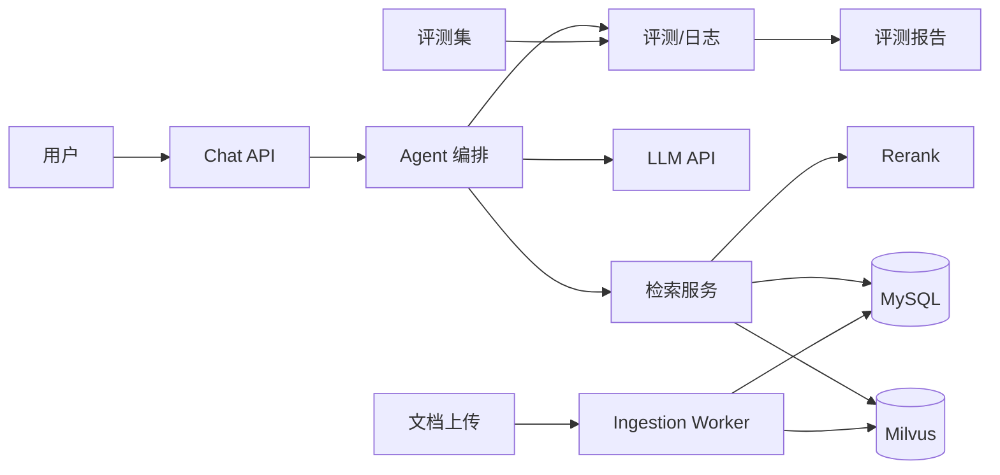

# RAG 应用设计文档：企业内部知识库/客服助手

## 1. 项目概述

### 1.1 目标

构建一个面向企业内部知识库与客服场景的 RAG + Agent 问答系统，支持文档上传、增量索引、检索增强回答、工具调用、引用溯源、效果评测和线上部署。

核心交付能力：

- 用户用自然语言提问，系统从企业内部文档中检索证据并生成可追溯的回答。
- Agent 能调用知识库检索、问题改写、答案校验等工具，支持多轮追问。
- 系统提供离线评测集与在线日志，能够量化回答质量、检索效果、延迟和成本。
- 项目以工程化为标准：FastAPI、Milvus、MySQL、Redis、Docker、日志和监控。

### 1.2 非目标

- 不训练、不微调大模型，不使用后训练方案。
- 不构建通用对话平台，不处理跨企业 SaaS 租户。
- 不做复杂权限审批流，仅保留基础文档权限字段。
- 不做分布式训练、推理集群或高并发生产级扩容。

### 1.3 技术栈

- 后端：Python 3.11 + FastAPI
- 向量存储：Milvus
- 关系数据库：MySQL 8
- 缓存与任务：Redis
- 检索：向量检索 + BM25/全文检索 + 可插拔 rerank
- LLM：OpenAI 兼容 API，支持切换模型
- 前端：轻量聊天界面，复用现有全栈能力
- 部署：Docker Compose，预留 CI/CD

## 2. 系统架构



## 3. 核心流程

### 3.1 文档入库流程

1. 用户上传 PDF、Word、Markdown、HTML 或纯文本文件。
2. 异步任务解析文档，提取正文、标题、表格和原始页码。
3. 清洗无用内容，如页眉页脚、重复段落、乱码和超长代码块。
4. 按层级结构切分文档，优先保留标题、段落和表格语义。
5. 为每个 chunk 生成 embedding，并写入 Milvus。
6. 将原始文本、来源文档、页码、标题路径和权限元数据保存到 MySQL，向量数据保存到 Milvus，通过 chunk_id 关联。
7. 支持同一文档版本更新，旧版本失效而非重复堆积。

### 3.2 问答流程

1. 接收用户问题与历史会话。
2. Agent 先判断是否需要改写问题，例如多轮指代或过长复合问题。
3. 调用知识库检索工具，同时执行向量检索和全文检索。
4. 合并结果后使用 rerank 重新排序，截取 top-k 证据。
5. 将系统提示、用户问题、证据块和输出约束拼装给 LLM。
6. 要求模型回答时给出引用编号，禁止输出没有证据支撑的结论。
7. 校验输出格式、引用编号和答案长度，不合格则重试一次。
8. 记录请求 ID、检索结果、模型输出、延迟、token 和成本。

## 4. 数据模型

### documents

| 字段 | 说明 |
| --- | --- |
| id | 文档 ID |
| title | 文档标题 |
| source_type | 上传来源类型 |
| status | pending / processing / ready / failed |
| version | 文档版本号 |
| created_at | 创建时间 |
| updated_at | 更新时间 |

### chunks

| 字段 | 说明 |
| --- | --- |
| id | chunk ID |
| document_id | 所属文档 |
| content | 切分后的正文 |
| heading_path | 标题路径 |
| page_no | 原始页码 |
| milvus_id | Milvus 中的向量 ID |
| token_count | 预估 token 数 |
| metadata | JSON 元数据 |

### milvus_chunks

Milvus 集合：

| 字段 | 说明 |
| --- | --- |
| pk | chunk_id |
| embedding | float vector |
| document_id | 所属文档 |
| page_no | 原始页码 |
| metadata | 检索过滤元数据 |

### conversations

| 字段 | 说明 |
| --- | --- |
| id | 会话 ID |
| user_id | 用户标识 |
| title | 会话标题 |
| created_at | 创建时间 |

### messages

| 字段 | 说明 |
| --- | --- |
| id | 消息 ID |
| conversation_id | 所属会话 |
| role | user / assistant / tool |
| content | 消息内容 |
| citations | 引用来源 JSON |
| created_at | 创建时间 |

### eval_cases

| 字段 | 说明 |
| --- | --- |
| id | 评测用例 ID |
| question | 问题 |
| expected_answer | 期望答案要点 |
| expected_sources | 期望引用来源 |
| tags | 场景标签 |

### eval_runs

| 字段 | 说明 |
| --- | --- |
| id | 评测批次 ID |
| model | 模型名称 |
| retrieved_chunks | 检索结果 |
| final_answer | 最终回答 |
| metrics | 指标 JSON |
| created_at | 创建时间 |

## 5. API 设计

### 5.1 对话

`POST /api/v1/chat`

请求体：

```json
{
  "conversation_id": "conv_001",
  "question": "年假可以累计到明年吗",
  "history": []
}
```

响应体：

```json
{
  "answer": "根据制度文档，年假原则上应在当年休完。",
  "citations": [
    {
      "chunk_id": "chunk_123",
      "document_id": "doc_456",
      "title": "员工休假制度",
      "page_no": 3
    }
  ],
  "trace_id": "trace_abc"
}
```

### 5.2 文档管理

- `POST /api/v1/documents`：上传文档并触发入库任务。
- `GET /api/v1/documents`：查询文档状态。
- `GET /api/v1/documents/{id}`：查看文档详情。
- `DELETE /api/v1/documents/{id}`：删除文档及其 chunks。
- `POST /api/v1/documents/{id}/reindex`：重新入库。

### 5.3 评测

- `POST /api/v1/evaluations/runs`：运行评测集。
- `GET /api/v1/evaluations/runs/{id}`：查看评测报告。
- `GET /api/v1/evaluations/cases`：管理评测用例。

## 6. 评测方案

### 6.1 评测集

至少准备 30-50 条业务评测用例，覆盖：

- 直接可从文档找到答案。
- 需要多篇文档合并。
- 多轮对话指代。
- 知识库无答案，应拒绝作答。
- 需要工具调用或追问澄清。
- 表格和长文档问答。

### 6.2 核心指标

- 检索命中率：期望文档是否出现在 top-k。
- 回答准确率：答案要点是否命中，可用人工或 LLM-as-judge 评估。
- 引用正确率：回答中的引用是否真正支持结论。
- 拒答准确率：无答案问题是否正确拒答。
- 工具调用成功率：Agent 工具参数是否正确。
- 平均延迟：首 token 延迟与总耗时。
- 单次成本：输入输出 token 与单次问答成本。

### 6.3 基线比较

每次改动后至少对比：

- 仅 top-3 向量检索。
- 向量 + 全文 + rerank。
- 是否启用查询改写。
- 不同 prompt 模板。
- 不同 chunk 策略。

## 7. 关键设计决策

### 7.1 使用 RAG，不做后训练

企业内部文档更新频繁，RAG 可以低成本替换知识；后训练成本高、更新慢，且无法直接解决检索与引用问题。本项目将后训练排除在范围外。

### 7.2 向量库选择 Milvus

Milvus 适合独立扩展向量检索能力，支持较大规模 embedding、标量过滤和混合检索。MySQL 负责文档、会话、评测等业务数据，两者通过 chunk_id 关联。

### 7.3 混合检索 + rerank

单独向量检索容易丢失精确术语和编号，MySQL 全文检索或独立 BM25 服务可以补充关键词匹配。Rerank 用于提升 top-k 证据质量。

### 7.4 Agent 只做必要编排

Agent 不追求复杂规划，核心是：

- 查询改写工具。
- 知识库检索工具。
- 答案校验工具。
- 无答案时的拒答策略。

这样可以降低不可控性，也能在面试中讲清楚工程取舍。

## 8. 风险与对策

| 风险 | 对策 |
| --- | --- |
| 召回率低 | 混合检索、rerank、查询改写、调整 chunk 策略 |
| 回答幻觉 | 强制引用、无证据拒答、答案校验、人工抽检 |
| 多轮问题失效 | 将历史会话摘要或最近消息传给 Agent |
| Agent 循环失败 | 限制最大轮数、工具异常重试、超时熔断 |
| 文档更新不一致 | 文档版本管理、增量索引、失效旧 chunk |
| 延迟过高 | 缓存高频问题、限制上下文长度、模型分级 |
| 成本不可控 | 记录 token 成本、设置每日限额、批量查询降级 |

## 9. 开发里程碑

### 第 1-2 周：核心 RAG

- 文档解析与清洗。
- chunking 策略。
- Milvus 入库，MySQL 保存文档与元数据。
- 基础检索和带引用回答。

### 第 3-4 周：工程化

- FastAPI 服务。
- 异步入库任务。
- Redis 缓存。
- Docker Compose。
- 简单聊天页面。

### 第 5-6 周：Agent 与评测

- Agent 工具调用。
- 查询改写与答案校验。
- 30-50 条评测集。
- 评测脚本与报告。
- 部署 demo 地址。

### 第 7-12 周：迭代

- 根据面试和实际问答反馈迭代。
- 补八股、算法和项目讲稿。
- 持续投递可转正实习。

## 10. 项目讲稿要点

面试时按以下结构讲：

1. 项目要解决什么问题。
2. 系统整体架构和核心链路。
3. 关键设计决策：为什么 RAG、为什么 Milvus、为什么 MySQL、为什么混合检索。
4. 指标和效果：检索命中率、回答准确率、延迟、成本。
5. 踩过的坑：切分不合理、召回不准、Agent 循环、引用错误。
6. 下一步优化：rerank 调优、在线评测、权限过滤、多轮记忆。
